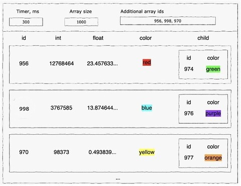

Тестовое задание для **B2Broker**

**Task:**  
Create a SPA application that receives large amounts of data with high frequency. The data should be received in the web-worker from a pseudo-socket and passed to the main thread. The main thread should render the incoming data in the amount of the last 10 elements.

**Requirements:**

1.  Make a pseudo-socket through a timer. Take into account the ability to change the value of the timer interval through the UI (input), in ms
2.  The size of the data array coming from the pseudo-socket can be adjusted via the UI (input)
3.  A single array element is an object that has the following fields:

- id - string field
- int - integer field
- float - float field (precision === 18)
- color - string field with color name (can be in any representation rgb, hex, string)
- child - field which is an object that has two fields - id and color

1.  Only the last 10 elements will be displayed in the UI and may contain their own set of ids, which can be set in the UI. For example, 1000 items come from the thread. Of these, 10 elements are selected for display as specified in the task. If `additional_ids` are set, the IDs are overwritten for the first elements of these 10 elements.
2.  In the main thread, you need to use not raw objects, but classes that are created based on the models described in step 3
3.  In the UI, it is required to display data in the following representation:

- each element is a table row
- fields are columns
- child is a nested table

When rendering the color column, it is necessary to fill its background with the color specified in the field

**Technologies and libraries:**

- angular 15
- web-worker
- jest || jasmine+karma

**The main points when checking the test:**

- 1.  compliance with the specified requirements
- 1.  use of specified technologies and libraries
- 1.  performance (under different given conditions)
- 1.  decomposition of code entities
- 1.  writing unit-tests (jest is preferable)

**Will be a plus:**  
Using design patterns  

